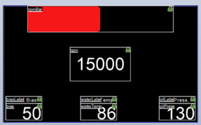

Iowa State University

<h3 style="text-align:center;">Electrical Design</h3>

Formula SAE

Cyclone Racing

2022-2023

CR-27

This document was originally a docx and has been converted to markdown. The original file can be found on Teams.

# Executive Summary

The overall objective of this project is to develop an embedded system for Cyclone Racing’s CR-27 vehicle. The team’s goal is to improve upon the telemetry system that was built for CR-26, so that the team can collect and view data in real time. This system will also provide a dash display for the drivers to view data and allow for custom displays to be created for specific events or drivers. This system is designed to provide the team with more data than Cyclone Racing has ever had. 
# Contents

[Table of Contents](#_Toc135260203)

[Introduction](#introduction)

[Failure Points](#failure-points)

[System Mounting](#system-mounting)

[Antenna Modularity](#antenna-modularity)

[PCBs](#pcbs)

[Microcontrollers](#microcontrollers)

[Sensors](#sensors)

[CAN Sensors](#can-sensors)

[Brake Temp Sensors](#brake-temp-sensors)

[Brake Pressure Sensors](#brake-pressure-sensors)

[Inertial Measurement Unit](#inertial-measurement-unit)

[Firmware](#firmware)

[Wireless](#wireless)

[Display](#display)

[Software](#software)

[Testing](#testing)

[Issues](#issues)

[Conclusion](#conclusion)

# Figures

[Figure 1: PCB Schematic with Communication Connections](#_Toc135260445)

[Figure 2: PCB Traces in Altium Designer 6](#_Toc135260446)

[Figure 3: Microcontrollers Mounted to the Mainboard PCB 7](#_Toc135260447)

[Figure 4: Brake Temp Sensor Calculations 8](#_Toc135260448)

[Figure 5: Screenshots and Pictures of Driver Specific Displays 10](#_Toc135260449)

[Figure 6: Picture of Telemetry Viewer Displaying Real Data 11](#_Toc135260450)

[Figure 7: Picture of the Breadboard Test System 11](#_Toc135260451)

[Figure 8: PCB Mounting Container 12](#_Toc135260452)

# Introduction

Last year, CR-26 had Cyclone Racing’s first ever home built telemetry system. The telemetry system enabled the ability to view engine data in real time and see what the drivers were doing. This year for CR-27, the goal was to produce a better version of this system with more data, more sensors, and a digital dash for the drivers. All these changes improve the data collection and allow other subsystems’ design choices to be validated efficiently.

# Failure Points

Before redesigning the system for this CR-27, issues from CR-26 were evaluated. The two largest issues were system mounting and antenna modularity.

## System Mounting

CR-26’s telemetry system was packed into a 3D-printed box and zip-tied to the front roll hoop. While this mounting worked, it was inconvenient to remove and replace and did not offer a good platform for making changes and future testing of the system. This year’s printed circuit boards (PCBs) design and mounting aims to correct this issue by making the system overall more modular and easier to remove and test. The PCB allows the system to have stable and consistent connections as well as a mainboard that can easily be mounted to the car.

## Antenna Modularity

The custom antenna solution for CR-26 caused some issues with the car’s wireless capable microcontrollers. This year, the system utilizes u.FL connectors to mitigate damage related to antenna mounting and strain. These connectors allow for easy testing of multiple antenna designs to optimize the wireless performance of the system.

# PCBs

The implementation of PCBs is a core addition compared to last year’s vehicle. The addition of PCBs allows the system to reduce weight as well as simplifying the testing and manufacturing process. PCBs offer the ability to expand as well as allows the team full customizability. PCBs are one time assembly, saving the team money as well as time, allowing there to be additional investment in other parts of the vehicle. For the brake temperature sensors, more PCBs were created to allow for ease of mounting and streamlining the wiring process. CR-27’s system weights 53% less than CR-26’s.

    

    Figure 1: PCB Schematic with Communication Connections

The team created schematics modeling the chosen hardware and needed connections to provide real time data. To create the PCB schematics, a version of the system using breadboards was built. This allowed the team to replicate and troubleshoot any electrical connections that are needed between microcontrollers, saving time in the manufacturing process, and reducing the need for repeated board orders. Using Altium Designer, each board was designed to maximize space efficiency while maintaining signal integrity. A four-layer circuit board was selected for the mainboard due to the amount of power and ground sources the system has. A two-layer circuit board was selected for the brake temperature sensors due to cost constraints and allows the sensors to be firmly protected against excess vehicle vibrations. Each PCB was milled out of FR-4, a standard glass enforced epoxy resin, that protects electrical signals while being lightweight and compact. The main PCB has a CAN shield, an Arduino Mega, and an ESP32 that collects data from eight types of sensors using various communication protocols such as Serial Peripheral Interface (SPI), inter-integrated circuit (I2C), and UART. Each microcontroller can be removed if needed, with headers soldered into the board to provide a more secure connection than jumper wires.

    

    Figure 2: PCB Traces in Altium Designer

Once the PCB had all the necessary connections soldered, the PCB was tested on the Dyno cart. This verified the connections and pinouts for power and ground were working. The main PCB is mounted to the car using Velcro encased in a 3D mold. Working with the Controls subsystem, the casing has holes to run wires to the PCB from various angles as well as Velcro adhesive on the top. PETG was selected for 3D printing applications due to its weather resistance and durability. The PCB was placed beneath the front roll hoop to be close to the display and easily accessible. This allows for changes to be made during testing as necessitated by driver feedback and car performance.

# Microcontrollers

The microcontrollers were selected based on accessibility and cost. All are based on an Arduino design, due to their range of vendor support and different capabilities. They excel in providing flexibility with design and providing a test platform conducive to rapid prototyping. The Arduino Mega runs at 16MHz which allows for great performance with a few sensors. This year’s system has increased the total number of sensors by 290% which has also increased the amount of data the Mega has to process. The Mega also only has one core, which limits the efficiency of the tasks that it must complete. For these reasons, the team is exploring other MCUs for our main controller for CR-28.

    

    Figure 3: Microcontrollers Mounted to the Mainboard PCB

The other primary Microcontroller used in CR-27’s telemetry system is an ESP32 Devkit C. This microcontroller allows the system to send and receive wireless data. The overall load on these boards is fairly small compared to the Mega and they are primarily used for their wireless capabilities. The boards utilize custom antennas and the ESP-now protocol to achieve wireless communication.

# Sensors

## CAN Sensors

All the engine data for CR-27 is received over CAN from the PE3 ECU. This data allows us to accurately collect data from the engine for use in both real-time wireless data and the diver’s display. The CAN Bus runs at 250Kbps, and we track a total of 9 engine parameters: RPM, Throttle Position, Fuel Open Time, Ignition Angle, Lambda, Air Temperature, Coolant Temperature, Oil Pressure, and Fuel Pressure. The versatility of the CAN Bus also allows the system to easily be configured to track more data points if necessary.

## Brake Temp Sensors

CR-27's system includes custom brake temp sensors. The sensors use a Melexis MLX90614 IR temperature sensor. This sensor allows us to collect temperature data of each rotor individually while the car is running. These sensors are used to validate the brake rotor simulations and monitor braking performance.

The MLX90614 sensor was chosen due to its object temperature range of -70°C to 380°C which is within the expected range of the rotor temperature. We also determined that the best FOV for the sensors was 35°. This value was found based off the constant width of the rotor and the mounting location available on the hubs. The calculations for this are shown in Figure 4**.**

    

    Figure 4: Brake Temp Sensor Calculations

## Brake Pressure Sensors

The brake pressure sensors for CR-27 were chosen by the team’s controls subsystem. The sensors are read as analog values and converted to PSI using the equation \(\frac{\left( \left( \text{Val} \right)\, \cdot 112.5 \right)}{1023} \cdot 14.504\). The value of 112.5 was chosen due to the max range of the sensor, the 14.504 is used to convert bar to psi, and the 1023 comes from the Arduino Mega’s analog function. The system reads both front and rear brake pressure separately. This also allows us to calculate brake bias for the system using the equation \(\frac{\left( 0.99*FPSI \right)}{\left( \left( 0.99*FPSI \right) + \left( 0.79*RPSI \right) \right)}*100\). The .99 and .79 values were provided by controls and come from the size of the front and rear calipers. All the brake temp sensors are connected to the system via I2C which allows for easy 2-wire runs to the wheel hubs. The I2C bus runs at 100kHz which adheres to the high standard of our real time system.

## Inertial Measurement Unit

CR-27 also uses an Inertial Measurement Unit (IMU) to measure the forces on the car. The sensor is mounted on top of the fuel tank underneath the car, close to the center of mass of the car for increased accuracy. The sensor the system uses is the Sparkfun ICM 20948 which has 9 degrees of freedom. This sensor provides the system with Accelerometer, Gyroscope, and Magnetometer in the X, Y, and Z dimensions. The IMU is hooked up to the system via I2C which allows for 100khz communication over a 2-wire system. This helps reduce wiring bulk while adhering to the high standard of our real time system. This sensor was also chosen due to its affordability and comprehensive documentation.

# Firmware

All the embedded portions of the system are written in C++ using Visual Studio Code and the Arduino IDE. This allows for the utilization of comprehensive features of Visual Studio Code while also the simplicity of uploading code with the Arduino IDE.

The firmware is written to be extremely modular. Each sensor and output device in the system is separated out into its own function, and each function is called in the main loop function. This allows the team to easily test individual sensors and small portions of the system by just commenting out a few lines. Overall, this approach has allowed us to easily troubleshoot issues and fix them much faster than in the past.

The main piece of firmware, for the Arduino Mega, handles most of the work. It collects all the sensor data from various sources and will format all the values into the correct units and compile them into a data structure. The data structure is then used as the main hub for all the complied and formatted data. Each function is called in the loop and the corresponding sensor values are updated in the struct. Finally, the Arduino Mega sends the data to two different output devices: the dash display and the ESP32. The dash display receives specific commands from the Arduino Mega to display the data in the correct location. The other output device, the ESP32, takes all the telemetry data and relays it wirelessly to another ESP32 setup as a wireless receiver. The receiver ESP’s firmware is setup to take in all the data and output it in CSV format. This allows the data to be read in by our custom software.

# Wireless

The wireless portion of the system uses Espressif’s ESP-Now protocol to send data between the sender and receiver ESP32 boards. This protocol allows for quick, low-bandwidth communication which is perfect for the type of data that we are sending. ESP-Now has a default bit rate of 1Mbps on the 2.4 GHz band and can send a maximum of 250 bytes per packet. Theoretically, this means that the ESP-Now protocol can handle 4000 packets per second.

With our current variable count, we are sending 32 float variables at 4 bytes each which makes our packets 128 bytes in total. This is only 51.2% of the maximum capacity of each packet. This means that we are sending around .512Mbps and have plenty of room to add more data points in the future as needed.

As for the latency of this data, testing has shown that the delay is not perceptible when watching the data come in. This is extremely important as the system need to perform in real time so that the data can be used to make tuning decisions and improve the overall setup of the car.

The final portion of the wireless system is the antenna. For CR-27, the system utilizes u.FL connectors to be able to easily swap antennas between boards and prevent damage to the ESPs. The antennas are monopole and have a calculated length to match the frequency of the ESP-Now protocol. To calculate the required length of the antenna, the following equation was used: \(\lambda = \frac{c}{f}\). In this equation, lambda (λ) is equal to the speed of light (c = 3x108) divided by the frequency of the signal (f = 2.4GHz). This equation results in a lambda value of 12.48in. If the antenna is a multiple of this lambda, it will give us effective results. Knowing this, we can use the value of 2λ to make the antenna length 24.98in on the car. In testing, having a longer antenna length on the car resulted in a better overall system range. The maximum tested range of the system was approximately 391m (1282.81 ft). This test was performed by sending 128-byte packages of dummy variables and walking the antennas away from each other until they disconnected. The distance was then measured on Google Maps to record an approximate maximum range.

# Display

CR-27’s telemetry system added a digital dash display for this year. Our display was chosen by researching different display technologies and making sure they exceeded last year’s off the shelf AiM solution. The team has not utilized the AiM’s capabilities in the past and it is a very expensive solution to a problem that we are more than capable of solving. One of the biggest considerations for a digital display was the display’s brightness. While looking at different options this was one of the main things that the team considered. After comparing different solutions, we settled on a Nextion display. The team put this display through rigorous testing on the car and dyno cart. The display was integrated into the system on breadboard testing first. After that, it was moved to the dyno cart where the team validated the data refresh rate and added input to the dash design. Finally, the display ended up on the car where it was tested in a real-world application as well as in the sunlight. The team also tested whether a UV screen made any difference and found from the drivers that it was preferred to increase the readability of the display. Each of the drivers have received a custom dash layout that allows them to see the data that they want to see. This allows for better data monitoring and driver satisfaction.

    
    
    

    Figure 5: Screenshots and Pictures of Driver Specific Displays

# Software

Our team’s software is built off CR-26’s “Telemetry Viewer”, an open-source software found on GitHub.com created by the user known as “farrellf”. Minor changes were made to the software for CR-26. These changes included a different color scheme for better visibility and a simple Dot-Plot graph.

For CR-27, the “Telemetry Viewer” changes included new visual displays and optimization. Visuals created for CR-27 consisted of bar graphs, wheel/brake temperature models and wheel speed models. The optimization changes were done to no longer cause as much strain on the user’s CPU & GPU. When it came to optimizing the software, this had to do with how the data flows and the order it reads to print visuals. With these optimizations, utilizing the software on smaller technology became available. The software was also tested on smaller, low power SOC devices, such as a Raspberry Pi. The optimization changes made for CR-27 have allowed the software to run on similar lower powered hardware for even more future applications.

    

    Figure 6: Picture of Telemetry Viewer Displaying Real Data

# Testing

The system was tested in two major ways and in two major forms: on the dyno cart and on the car as well as on breadboards and on the PCB.

The first set of testing was the breadboards with dummy data. This allowed us to make sure the basic functionality of the system was up and running while still allowing for easy changes and updates. In this stage, the team got all the sensors and outputs working on a basic level.

    

    Figure 7: Picture of the Breadboard Test System

The next stage was to move the breadboard test system to the dyno cart to get real world engine data. This step allowed for the system to be load tested and make sure that it would be able to handle an increase in tasks and data. In this stage, we were also able to finalize the PCB pinouts and designs which allowed us to minimize errors with the PCB orders.

Third, we mounted the system to the new mainboard PCB and ran it on the dyno cart again. This stage of testing allowed for the new boards to be validated and pinouts to be confirmed before the car was built. Overall, this stage finalized the system before mounting it to the car.

Finally, the PCB with the system installed was mounted to the car. This is the final stage for our design and where we ran into our biggest mechanical issue before the system was fully functional.

# Issues

CR-27’s system had a few major issues, mostly mechanical. The first of these issues was mounting. The team chose to solve this issue by working with other Mechanical Engineers on the team to design mounting solutions for both the mainboard PCB and the dash display. This led to a PCB enclosure that mounts behind the dash and steering column. This mounting location allows for a central location for the telemetry system as well as a much more modular mounting system and robust system.

    

    Figure 8: PCB Mounting Container

The other major issue was the system’s inconsistent freezing. The team first noticed this issue in the first few testing sessions where the display data would freeze randomly. The team originally hooked up a Raspberry Pi to read the serial output to see what function it would freeze on. This led us to believe that the serial communication between the Mega and ESP32 was causing the crashes as that is where the serial debug froze twice in a row. After diving into this issue, it was discovered that the vibrations of the car were causing the exposed back of the display to contact the carbon chassis. Since carbon fiber is conductive, this was causing the whole system to freeze up. To fix this problem, the team spent time insulating the back of the display as well as the chassis points near the telemetry system and components. Overall, this extra insulation solved the problem and repaired the reliability of the system.

# Conclusion

In conclusion, CR-27’s system cut weight, increased efficiency, improved mounting, improved antennas, and improved upon the dash solution. The system has been a success and an overall improvement on everything that was built for CR-26. The electrical subsystem at Cyclone Racing has learned a lot this year and has huge goals for the future to continue to improve and outperform previous designs and systems.
